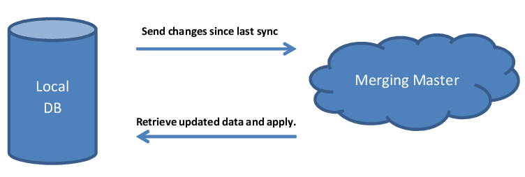
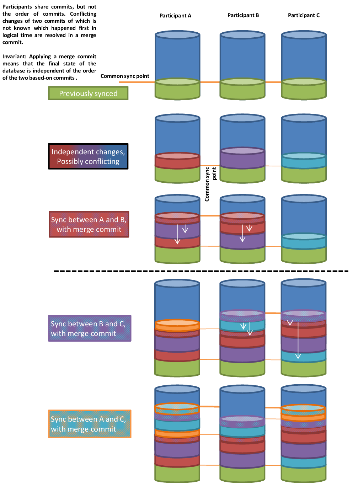

# NinjaSync

NinjaSync is a portable class library for synchronizing arbitrary objects between multiple devices. Its supports both master/slave and P2P scenarios. It is - up to a limit - even safe to mix both.

## Main Features
  - Supports both master/slave and peer-to-peer (P2P) synchronization.
  - NinjaSync tries hard to prevent conflicts by imposing a logical time based on commits on all changes. 
  - Changes to objects are tracked on a per-property basis.
  - In case conflicts can not be resolved through logical time, they are merged based on the modification time of each property.
  - Changes are tracked on a per-property basis.
  - NinaSync supports full background synchronizations: Local changes to the data store can be made and will be taken into account even when a sync is in progress.
  - Comes with Sqlite backing storage, but can easily be extended to support other storages as well.
  - Comes with Bluetooth and TCP/IP P2P sync, though the transport can be easily replaced.

## Motivation

NinaSync developed out of the need for a TODO-list synchronization solution between multiple android devices and a windows host, while leaving Big Brother out of the loop. There where bearable solutions for calendar and contact synchronization [Baikal, DavDroid, SogoConnector, Lightning], though they have the drawback of requiring you to set up a server somehow, connect it to the internet and what-not.
A usable TODO-lists solution did not even exist. While there was some effort (Mirakel, Taskwarrior) they where either not very stable (Mirakel) or difficult to setup (Taskwarrior).

Here is where NinjaSync P2P steps it. Why need a server, when all we want to do is to sync our phone with our tablet and our computer? Distributed version control systems have made great leaps in the last couple of years (Git). NinjaSync utilizes the same ideas to synchronize structured objects between different devices.  

## How synchronization works

### Introduction

Synchronization would be rather simple if it weren't for conflicting changes to the underlying data at two or more endpoints. For the purpose of this document, a conflicting change is a modification of the same property of an object at different endpoints which happened concurrently, i.e. for which a [strong logical order](http://en.wikipedia.org/wiki/Logical_clock) can not be reconstructed. Other types of conflicting changes include deletions, which are covered in [short section](#deletions) on their own.

### Master/Slave synchronization

Master/Slave synchronization is the more traditional approach to synchronization. Although even Master/Slave sync is difficult to get right, it is simpler both to understand and implement than P2P sync.

In the following, it is assumed that the server takes the role of the merging master, and the client the role of the "dumb" slave. This is how synchronization is done in e.g. Taskwarrior server. In many scenarios, these roles are reversed, and the merging is actually done at the client/slave side. All presented concepts apply with minor modifications to those scenarios as well.

At a first glace, the update process might look like this: The client sends its local changes to a merging master, and retrieves new changes back, which it stores locally.
 

There are some things to consider though. The communication between client and master might take some time. What happens so the local database during the update, can the user continue to edit objects? One simple solution would be to block all user changes while a sync is in progress. If the connections hangs for several minutes, that would provide for a rather unsatisfactory user experience though. Another approach would be to cache all user changes in memory during sync, and save them after the sync is completed. This will lead to the difficulties when the user want's to close the program before the sync is complete and to data loss on power failure. Furthermore there is no clear way to handle situations where the user syncs his data with multiple sources (P2P).

NinjaSync therefore introduces virtual sync points with Master/Slave sync, as shown in the following diagram (Note that only the worst case scenario with intermediate changes is displayed). Intermediate changes can be saved in the local database even if a sync is in progress. Upon retrieval of the remote updated data, the intermediate changes are blocked from being overridden. On the next sync everything from the intermediate changes, excluding the last retrieved server changes, will be uploaded. Note that with this scheme, the database has only be locked for the short time it takes to subtract the intermediate changes from the server changes, and applying these server changes.     

Now let's have a look at the other side and assume we are the merging master. A sync processes as follows. We retrieve new changes since our previous mutual sync point, but have intermediate changes from other sources. As we have no other information, we have to assume that both changes happened concurrently. Conflicting changes have to be merged. NinjaSync currently employs a modification time based merge, where the later - according to the client's time - changed value will overwrite any earlier changes (see below [Merging Strategy](#merging)). We therefore accept non-conflicting changes and those accepted by the merge strategy. We then subtract the accepted remote changes from the intermediate changes, and send these changes back to the slave/client.  

### P2P synchronization

(**TODO**: explain the diagram)

### Merging Strategy

Obviously, synchronization must not rely upon date/time values, since these can and will be inaccurate or entirely false. Date/Time values can be used to aid in conflict resolution though.

NinjaSync currently employs a conflict-merge based on modification time of individual properties. The later - according to the client's time - changed value will overwrite any earlier changes. 
This could be a problem if (a) one or more client's have wrong clocks, and (b) syncs happen infrequently, and (c) different clients edit the same property of an object, i.e. actually produce a conflicting change.

Now (a) can easily happen, that's why we have the notion of a logical time in the first place. In the scenario for which NinjaSync was designed (a), (b) and (c) at the same time should happen seldom. The employed simple merging strategy should therefore provide the best trade-off between "correct" behavior (whatever that might be) and complexity of the merge and/or user interaction.

### Out-Of-Sync handling

An out-of-sync situations means that the expected mutual sync-point of a synchronization endpoint does not exist on one of the endpoints. This situation can arise in the Master/Slave scenario when the master e.g. crashes and a backup is restored. In the P2P scenario this can happen e.g. when one peer gets a fresh database, e.g. when the app was uninstalled and re-installed. Out-of-sync might also arise out of software bugs.

Since these scenarios are not too far fetched, we believe it important to handle out-of-sync situations transparently if possible. NinjaSync will, upon detection of an out-of-sync situation, restart the sync as a fresh sync. At a fresh sync the two endpoints act as if the haven't ever been synchronized before. 
This should pose no problem at all in a P2P scenario, since each peer will only apply commits not yet applied at his local data store. It will merely result in a slightly larger exchange of commit id's. 
For Master/Slave scenarios this means the whole slave database will be treated as if happened concurrently with the whole master database. (TODO: think about the implications of this. On a first glace I believe this should not pose a serious problem).

### Deletions

There are at least two ways to handle deletions. One is a simple "was deleted" flag. This works like a recycle bin, where items can be undeleted as well. This deleted flag can be handled like any other property of an object which gets synced as explained above in the various sync strategies. 
The other way is the actual removal of the item from the data store. We believe that it is important to be able to actually purge objects from the database. In NinjaSync deletion takes precedence over modification. I.e. a concurrent modification to an object is simply dropped. The reincarnation of a deleted object is not possible, as this could give different result depending on doing a [fresh sync](#OutOfSync) or an incremental one.

### Sync a non-versioning slave – possibly having a similar but different data model – with a conflict merging master.

This situation arises when the slave does not provide reliable change tracking and/or when the slave employs a slightly different data model than the master. A different data model could e.g. mean different time resolution, or having only two instead if three values e.g. for a "Priority" property.
To solve the he first problem we introduce an intermediate data storage. Whenever we dump the slave's data into the intermediate database we get the required change tracking information.
The second problem is a little bit trickier. Before storing the master's changes into the intermediate data storage, we have to transform the master's data into the slave's representation and back. If we fail to do so, we could trigger an infinite change-ping-pong. With the next dump of the slave data - which has e.g. a lower time-resolution - it would appear that the client has changed the time, even though he has not. If we have more than one slave synchronizing with the master, the slaves can end up sending ghost changes back and forth.    

### Sync a non-versioning storage with P2P

Let's assume we want to sync an android calendar across devices, using P2P, where the calendar storage would not provide any version information. We can sync the calendar by introducing two additional storages. One to determine changes to the calendar, and one to for actually performing the P2P sync, as shown in the next diagram. 

### Thoughts on synchronizing 

**Ids**. We strongly recommend to used Guids as Ids for all synchronized objects. Id mapping that does not happen at the endpoints is bad thing, even though partially supported in Master/Slave scenarios by NinjaSync. It should be avoided whenever possible, since it easily leads to object duplication when two endpoints get out of sync for some reason (e.g. data backup restoration on one endpoint; bugs).

## Introduction guide to the code.

- `ITrackable`
	Interface, that must be implemented by all objects that are going to be synchronized.   
    
- `TrackableBase`	
	If you have control of the data model, you can inherit you synchronized classes from `TrackableBase`, which provides an `ITrackable` implementation.  

- `JournalEntry`
	this class represents a modification to an `ITrackable`, specifying the modification (create, delete, modify) and - if applicable - the 	modified field. Most of the code doesn't deal with these entries directly but with `Modification`, `Commit` and `CommitList`. These  provide a higher abstraction. 

- `ITrackableStorage`	
	A CRUD service for ITrackable objects. A Sqlite implementation is provided.

- `ITrackableJournalStorage` 
    This class provides access to the change tracking of an `ITrackableStorage` A Sqlite implementation is provided.

- [many more...]
 
 
   